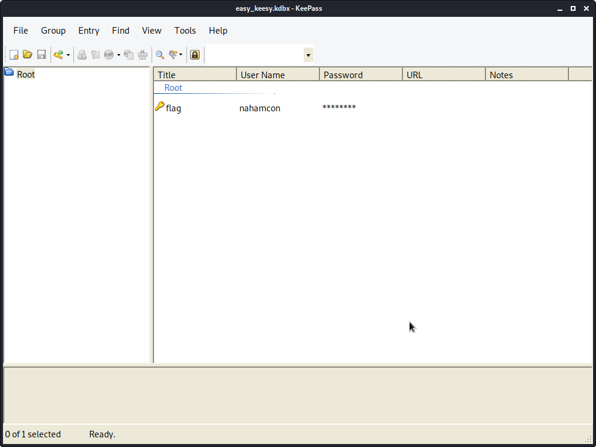

1. Downloaded the provided file and renamed it to "easy_keesy"

2. Running `file` on easy_keesy shows that it is a Keepass password database:

```
easy_keesy: Keepass password database 2.x KDBX
```

3. Install keepass2 as needed. `sudo apt install keepass2`

4. I used `keepass2 easy_keesy` to open it but it requires a password. Using `/usr/sbin/keepass2john` you can pull a password hash out:
```
/usr/sbin/keepass2john easy_keesy > kp
```

5. Running john with the infamous rockyou.txt wordlist cracks the hash after a few seconds:
`sudo john --wordlist=/usr/share/wordlists/rockyou.txt kp`

```
Using default input encoding: UTF-8
Loaded 1 password hash (KeePass [SHA256 AES 32/64])
Cost 1 (iteration count) is 100000 for all loaded hashes
Cost 2 (version) is 2 for all loaded hashes
Cost 3 (algorithm [0=AES, 1=TwoFish, 2=ChaCha]) is 0 for all loaded hashes
Will run 4 OpenMP threads
Press 'q' or Ctrl-C to abort, almost any other key for status
monkeys          (easy_keesy)
1g 0:00:00:02 DONE (2020-06-12 15:06) 0.4166g/s 246.6p/s 246.6c/s 246.6C/s evelyn..thunder
Use the "--show" option to display all of the cracked passwords reliably
Session completed
```

6. Rerunning `keepass2 easy_keesy` and inputting `monkeys` as the password opens the database and you can copy the flag right out!



Flag: flag{jtr_found_the_keys_to_kingdom}

