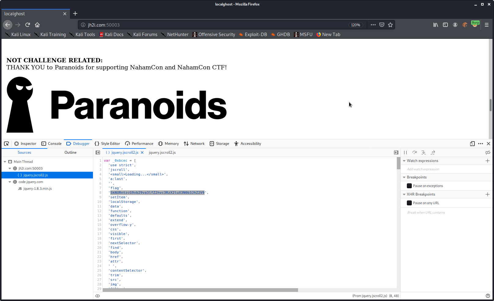

1. Visiting the target page (http://jh2i.com:50003/) shows us some SpOooOOOo00oOOo0ky ASCII art.
```

    .-.
   .'   `.
   :g g   :
   : o    `.
  :         ``.
 :             `.
:  :         .   `.
:   :          ` . `.
 `.. :            `. ``;
    `:;             `:'
       :              `.
        `.              `.     .
          `'`'`'`---..,___`;.-'
```

2. (In Firefox) Right click, inspect element, click debugger. Right click the jquery.jscroll2.js script and pretty-print.


Hmm, that flag item looks like base64, and it is!

Flag: JCTF{spoooooky_ghosts_in_storage}
